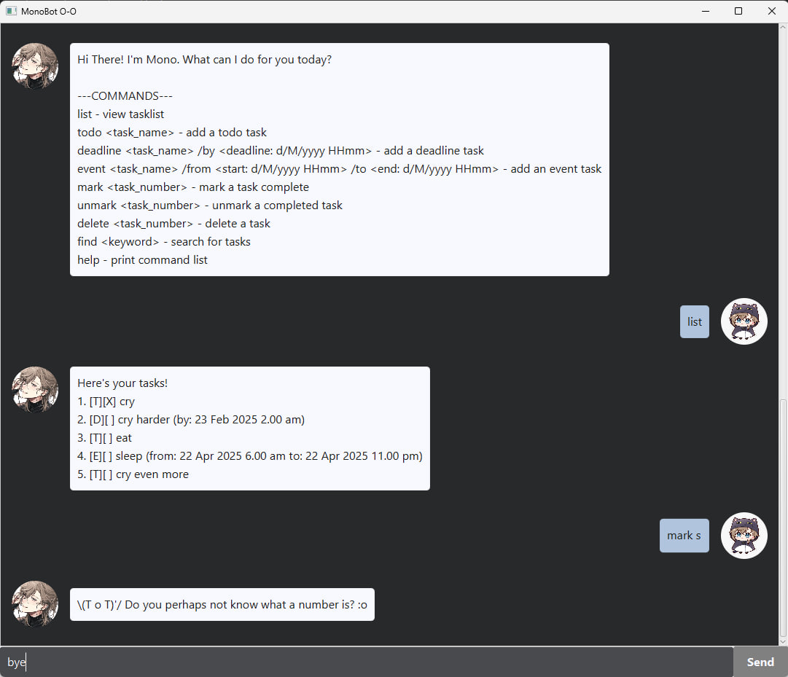

# Mono Bot User Guide




Welcome to Mono Bot's User Guide! Mono Bot is a handy CLI GUI for keeping track of your tasks!

## Adding Tasks

Mono Bot classifies tasks into three types:    
- Todo,
- Deadline, and
- Event!

Todos only have a name,      
Deadlines have a date and time it must be completed by,    
while Events have a start and end date and time!    

To add a task, simply send Mono Bot a `todo`, `deadline` or `event` command!    
Example: `todo feed my cat`, `deadline submit project /by 21/2/2025 2359`, `event sleep /from 02/04/2025 2300 /to 03/04/2025 1000`...    

Mono Bot will keep track of those tasks for you!    
```
Got it! I've %s this task for you:
-> %s [D] submit project (by: 21 Feb 2025 11.59 pm)
Now you have 2 task(s) in your list :D
```
You can use the command `list` to view all your tasks!    
```
Here's your tasks!
1. [T][ ] feed my cat
2. [D][ ] submit project (by: 21 Feb 2025 11.59 pm)
3. [E][ } sleep (from: 2 Apr 2025 11.00 pm to: 3 Apr 2025 10.00 am)
```
## Deleting Tasks
To delete a task, use the `delete` command, with the index number associated with the task as shown with `list`.    
Example: `delete 1`, `delete 2`...    
NOTE: After deleting a task, the task numbers will refresh, so please check the task numbers again with `list` before deleting another task!    

## Finding Tasks

Too many tasks? Don't worry! You can search for specific task(s) using the `find` command alongside a search keyword!    
Example: `find cry`, `find CS2103T`...    
Mono Bot will search (non-case sensitive) for the keyword within all task names and list only tasks which match!    

## Marking Tasks

To keep track of which tasks have been completed, Mono Bot can mark tasks for you using the `mark` command!    
Example: `mark 1`, `mark 2`...    
```
Task 1 has been marked complete!
```
Similarly, to unmark a task, use `unmark`.    
Example: `unmark 1`, `unmark 2`...    

## Commands
Here is the full command list. If you ever forget, simply use the `help` command and Mono Bot will tell you!        
`list` - view tasklist        
`todo <task_name>` - add a todo task     
`deadline <task_name>` /by <deadline: d/M/yyyy HHmm> - add a deadline task     
`event <task_name>` /from <start: d/M/yyyy HHmm> /to <end: d/M/yyyy HHmm> - add an event task     
`mark <task_number>` - mark a task complete     
`unmark <task_number>` - unmark a completed task     
`delete <task_number>` - delete a task    
`find <keyword>` - search for tasks      
`help` - print command list    

## Final Notes
Thank you for trying Mono Bot and enjoy an organised procrastination-free lifestyle!!! :)
